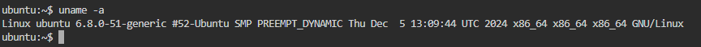

## Comandos en Linux

**uname**

El comando `uname -a` en sistemas Unix/Linux muestra información detallada del sistema operativo. La opción `-a` (abreviación de all) muestra toda la información disponible.

```markdown
uname -a
```


