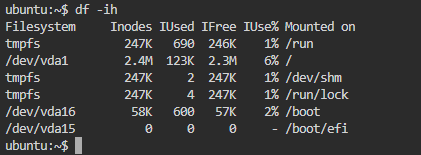
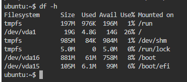

# Comandos en Linux

## 💾 comando `uname`

El comando `uname -a` en sistemas Unix/Linux muestra información detallada del sistema operativo. La opción `-a` (abreviación de all) muestra toda la información disponible.

```markdown
uname -a
```


## 💾 comando `whoami`

El comando `whoami` en sistemas Unix/Linux (y también en Windows) muestra **el nombre del usuario actualmente autenticado** en la sesión del terminal.

```markdown
whoami
```


Ejemplo de script simple para validar si estas usuando el usuario root

```
cat << EOF > whoami.sh
#!/bin/bash
if [ "\$(whoami)" = "root" ]; then
    echo "Tienes sesión con el usuario root"
else
    echo "No tienes sesión con el usuario root, estás con el usuario '\$(whoami)'"
fi
EOF
```

Asignar permisos de ejecucion al script
```
chmod +x whoami.sh
```

Ejecutar el script
```
./whoami.sh
```

## 💾 comando `uptime`

El comando `uptime` en Linux/Unix muestra información sobre **cuánto tiempo lleva encendido el sistema**, así como la **carga promedio del CPU**.

```
uptime
```
`uptime -p` Muestra solo el tiempo encendido (más legible).
```
uptime -p
```
`uptime -s` Muestra la fecha y hora del último arranque.
```
uptime -s
```


## 💾 comando `top`

El comando `top` muestra en **tiempo real** información sobre el uso del sistema, como:

- Procesos activos
- Uso de CPU y memoria
- Carga del sistema
- Usuarios conectados

Es una de las herramientas más usadas para **monitorear el rendimiento** del sistema en vivo.

```
top
```

### 📋 Encabezado de procesos en `top`

| Columna | Nombre            | Descripción                                                                 |
|---------|-------------------|-----------------------------------------------------------------------------|
| `PID`   | Process ID         | **Identificador del proceso**. Número único asignado por el sistema.        |
| `USER`  | Usuario            | **Usuario propietario** del proceso.                                        |
| `PR`    | Priority           | **Prioridad** del proceso (bajo número = más prioridad).                    |
| `NI`    | Nice value         | Nivel de **"amabilidad"** del proceso (de -20 a 19).                        |
| `VIRT`  | Virtual Memory     | **Memoria virtual total** usada (RAM + swap + cache + libs).                |
| `RES`   | Resident Memory    | **Memoria residente en RAM** usada actualmente por el proceso.              |
| `SHR`   | Shared Memory      | **Memoria compartida** con otros procesos (como bibliotecas compartidas).   |
| `S`     | Estado del proceso | Estado actual del proceso. Valores posibles:                                |
|         |                    | - `R`: **Running** – Ejecutándose                                           |
|         |                    | - `S`: **Sleeping** – Inactivo temporalmente                                |
|         |                    | - `D`: **Uninterruptible sleep** – Esperando I/O                            |
|         |                    | - `Z`: **Zombie** – Finalizado pero no recogido                            |
|         |                    | - `T`: **Stopped** – Detenido manualmente (ej. con SIGSTOP)                |
|         |                    | - `I`: **Idle** – Inactivo (usado principalmente en kernels recientes)     |
| `%CPU`  | Uso de CPU         | **Porcentaje de CPU** que está usando el proceso en ese instante.          |
| `%MEM`  | Uso de RAM         | **Porcentaje de memoria RAM** usada por el proceso respecto al total.      |
| `TIME+` | Tiempo de CPU      | **Tiempo total de CPU** que ha consumido desde que se inició.               |
| `COMMAND`| Comando ejecutado | **Nombre o ruta del comando/proceso** en ejecución.                        |
                               |

---

 ### 📌 Tip: Ordenar procesos en `top`

Dentro de `top` puedes:

- Presionar `P` para ordenar por `%CPU`.
- Presionar `M` para ordenar por `%MEM`.
- Presionar `k` para terminar un proceso (te pide el `PID`).
- Presionar `1` para ver el uso de CPU por núcleo.                  |


## 💾 comando `free`

Muestra un resumen del uso de la **memoria RAM** y **memoria swap** del sistema, en un formato legible para humanos.

---

```bash
free -h
```
| Columna      | Descripción                                                                |
| ------------ | -------------------------------------------------------------------------- |
| `total`      | **Memoria total** disponible en el sistema.                                |
| `used`       | Memoria **en uso actualmente** (aplicaciones + buffers + caché).           |
| `free`       | Memoria completamente **libre** (no utilizada en absoluto).                |
| `shared`     | Memoria **compartida** entre procesos (usualmente por tmpfs).              |
| `buff/cache` | Memoria usada por el sistema para **buffers y cachés** (se puede liberar). |
| `available`  | Estimación de memoria que puede usarse **sin afectar procesos activos**.   |

 Muestra en KB por defecto
 ```
 free
 ```
Muestra en MB
 ```
 free -m
 ```


Actualiza cada 5 segundos (útil para monitoreo)
```
free -s 5 -h
```


## 💽 Comando `df`

El comando `df` (disk free) muestra información sobre el **uso del espacio en disco** de los sistemas de archivos montados.

```
df -h
```

## 📊 Explicación de columnas del comando `df -h`

| Columna      | Descripción                                                                 |
|--------------|------------------------------------------------------------------------------|
| `Filesystem` | Sistema de archivos o dispositivo (ej. `/dev/sda1`).                        |
| `Size`       | Tamaño total del sistema de archivos.                                       |
| `Used`       | Espacio utilizado actualmente.                                              |
| `Avail`      | Espacio disponible para nuevos archivos.                                    |
| `Use%`       | Porcentaje de uso del espacio.                                              |
| `Mounted on` | Punto de montaje del sistema de archivos (ej. `/`, `/home`). 

---

El comando `df -i` muestra el **uso de inodos** en lugar del uso de espacio en disco.

Un **inodo** es una estructura de datos del sistema de archivos que almacena información sobre archivos y directorios (no su contenido).  
Por lo tanto, si se agotan los inodos, **no podrás crear más archivos**, incluso si todavía hay espacio en disco disponible.

```
df -i
```


📊 Explicación de columnas del comando `df -i`

| Columna      | Descripción                                                                 |
|--------------|------------------------------------------------------------------------------|
| `Filesystem` | Sistema de archivos o dispositivo (ej. `/dev/sda1`).                        |
| `Inodes`     | Número total de inodos disponibles en ese sistema de archivos.              |
| `IUsed`      | Inodos en uso, es decir, la cantidad de archivos/carpetas existentes.       |
| `IFree`      | Inodos libres aún disponibles para crear archivos/directorios.              |
| `IUse%`      | Porcentaje de inodos usados (`IUsed / Inodes`).                             |
| `Mounted on` | Punto de montaje donde está montado ese sistema de archivos (ej. `/`, `/home`, etc.). |

